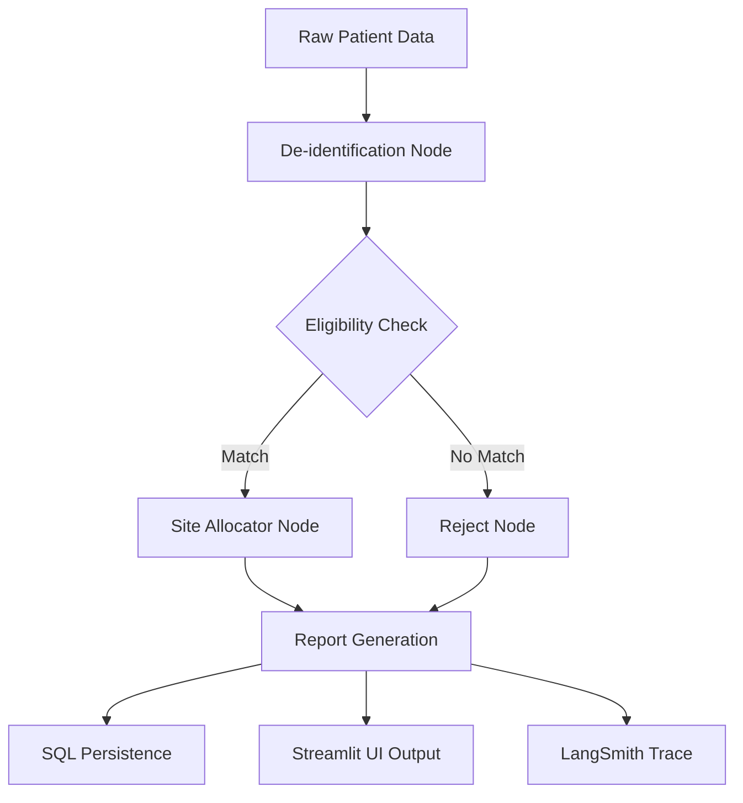

# 🧬 TrialMatch AI: Agentic Clinical Trial Pre-Screening

TrialMatch AI is an enterprise-grade agentic pre-screening system designed to accelerate patient enrollment in clinical trials. By leveraging state-of-the-art LLMs and LangGraph orchestration, it reduces manual screening time from weeks to seconds.

---

## 🛑 The Problem
- **80% of trials fail** to meet enrollment deadlines.
- **$8M per day** is the estimated cost of trial delays for pharmaceutical companies.
- **Manual screening is slow:** Coordinators must read through 40+ page eligibility checklists per patient, often taking up to 6 weeks.
- **Pathologist Shortage:** Bandwidth is the bottleneck; human-only processes cannot scale for global trials.

## 🚀 Our Solution
TrialMatch AI solves the #1 cause of trial failure—slow enrollment—by using a stateful **LangGraph Agent** to automate the eligibility auditing process. The system ensures clinical precision while maintaining a "coordinator-in-the-loop" model for final decision-making.

---

## ✨ Key Features
- **🤖 Agentic Workflow:** Uses a directed acyclic graph (DAG) to de-identify data, check eligibility, and assign clinical sites.
- **📊 Executive Dashboard:** Professional real-time analytics for enrollment rates and system performance.
- **🔒 HIPAA-Aware Design:** Built-in de-identification node ensures PII never reaches the reasoning model.
- **📈 Site Optimization:** Intelligent scoring for site allocation based on geographic proximity and capacity.
- **📜 Live Audit Trail:** Integrated with **LangSmith** for 100% transparency into AI reasoning.
- **🚀 Scalable Backend:** Containerized FastAPI architecture deployed on **GCP Cloud Run**.

---

## 🏗️ System Architecture


---

## 🛠️ How to Use

### 1. Ingest Cohort
Go to the **Cohort Management** tab and click **🚀 Simulate Synthea Ingestion**. This generates synthetic FHIR-ready patient records (Age, HbA1c, Diagnosis, etc.) and persists them in the database.

### 2. Run AI Engine
Navigate to the **AI Screening Engine**. The active trial criteria (e.g., Phase II Ovarian Cancer study) are loaded automatically. Click **🚀 Execute Batch Pipeline** to trigger the LangGraph agent for all pending patients.

### 3. Review Analytics
Use the **Executive Dashboard** and **Clinical Analytics** tabs to view enrollment funnels, processing latencies, and site allocation maps.

---

## 🧪 How to Test

### Automated Testing
The system includes a comprehensive suite of unit and integration tests using `pytest` and `pytest-cov`.

```bash
# Run all tests with coverage report
$env:PYTHONPATH="."
pytest --cov=. --cov-report=term-missing tests/
```

### Local Development
1. **Clone & Setup:**
   ```bash
   py -m venv venv
   .\venv\Scripts\Activate.ps1
   pip install -r requirements.txt
   ```
2. **Environment Variables:**
   Create a `.env` file based on `.env.example` with your `OPENROUTER_API_KEY`.
3. **Launch:**
   - Backend: `uvicorn main:app --reload`
   - Frontend: `streamlit run ui/app.py`

---

## 🌐 Deployment Details
- **Backend:** [GCP Cloud Run](https://trialmatch-backend-1051385917818.us-central1.run.app)
- **Frontend:** [Streamlit Community Cloud](https://share.streamlit.io/)
- **Observability:** [LangSmith Audit Trail](https://smith.langchain.com/projects/p/TrialMatch-AI-Enterprise)

---
*Built for the future of clinical research.*
