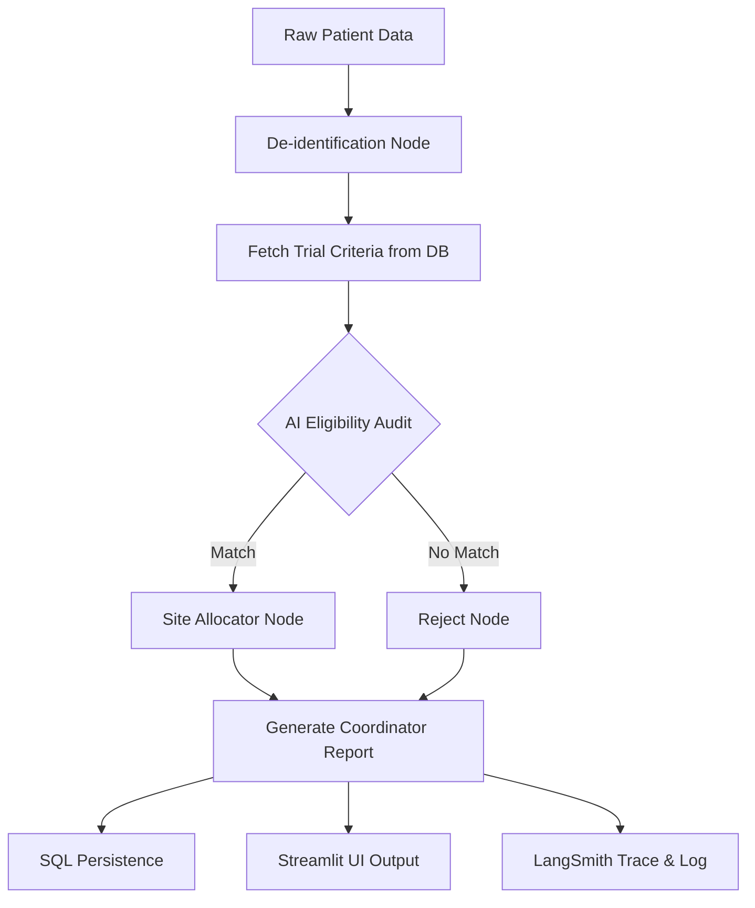

# 🧬 TrialMatch AI: Agentic Clinical Trial Pre-Screening

TrialMatch AI is an enterprise-grade agentic pre-screening system designed to accelerate patient enrollment in clinical trials. By leveraging state-of-the-art LLMs and LangGraph orchestration, it reduces manual screening time from weeks to seconds.

---

## 🌟 Simple Explanation (Beginner Friendly)

### The Problem: The "40-Page Checklist" Bottleneck
Imagine a doctor wants to help a patient join a new clinical trial for cancer. To do this, a human coordinator has to read a **40-page manual** of rules (like "Must be over 45," "Must not have had chemo in 6 months," "Must have a specific blood sugar level"). 
*   **It's slow:** It takes weeks to check just one patient.
*   **It's expensive:** Every day a trial is delayed costs millions of dollars.
*   **It's manual:** 80% of trials miss their deadlines because they can't find patients fast enough.

### Our Solution: An AI "Medical Auditor"
TrialMatch AI is like giving the coordinator a super-intelligent assistant that has already memorized every rule in the manual.
1.  **De-identification:** First, the AI "blurs" the patient's name and private ID to keep them safe and anonymous.
2.  **Eligibility Audit:** The AI "reads" the patient's medical record and compares it to the trial rules instantly.
3.  **Site Matching:** If the patient is a match, the AI finds the closest hospital that has an open spot.
4.  **Coordinator Report:** The AI writes a clear summary explaining **why** the patient matched, so the human coordinator can make the final call in seconds instead of weeks.

---

## 🛑 The Problem (Business Context)
- **80% of trials fail** to meet enrollment deadlines.
- **$8M per day** is the estimated cost of trial delays for pharmaceutical companies.
- **Manual screening is slow:** Coordinators must read through 40+ page eligibility checklists per patient, often taking up to 6 weeks.
- **Pathologist Shortage:** Bandwidth is the bottleneck; human-only processes cannot scale for global trials.

## 🚀 Our Solution (Technical Approach)
TrialMatch AI solves the #1 cause of trial failure—slow enrollment—by using a stateful **LangGraph Agent** to automate the eligibility auditing process. The system ensures clinical precision while maintaining a "coordinator-in-the-loop" model for final decision-making.

---

## 🏛️ Organizational Benefits (ROI)
- **10x Faster Enrollment:** Reduces the manual burden on clinical coordinators, allowing organizations to launch trials months ahead of schedule.
- **Reduced Recruitment Costs:** Automates the "first pass" of screening, ensuring expensive human experts only focus on highly likely candidates.
- **Global Scalability:** The agent can process thousands of patients across multi-site global trials simultaneously, something impossible for human teams.
- **Audit-Ready Compliance:** Every decision is traced and logged, providing a perfect "paper trail" for regulatory bodies (FDA/EMA).

---

## 🎯 Multi-Trial Capability & Match Logic

The system dynamically handles multiple medical conditions. A "Match" or "No Match" is determined by the AI Agent based on the following specific criteria sets:

### 1. Ovarian Cancer (ONCO-2025-001)
*   **Match Basis:** Age 45-70, HbA1c > 7.5, ECOG Status 0-1 (High mobility).
*   **Auto-Reject:** Prior chemotherapy within 6 months or active autoimmune disease.

### 2. Lung Cancer (LUNG-2025-002)
*   **Match Basis:** Age 18-80, Positive PD-L1 expression (>1%).
*   **Auto-Reject:** Metastatic disease to the brain or history of other cancers within 2 years.

### 3. Type 2 Diabetes (DIAB-2025-003)
*   **Match Basis:** HbA1c between 7.0 and 10.5, BMI > 27 kg/m2.
*   **Auto-Reject:** Type 1 Diabetes diagnosis or current use of insulin.

---

## ✨ Key Features
- **🤖 Agentic Workflow:** Uses a directed acyclic graph (DAG) to de-identify data, check eligibility, and assign clinical sites.
- **🏢 Multi-Trial Support:** Dynamic selection dropdown allows coordinators to switch between different study protocols instantly.
- **📊 Executive Dashboard:** Professional real-time analytics for enrollment rates and system performance.
- **🔒 HIPAA-Aware Design:** Built-in de-identification node ensures PII (Personal Identity) never reaches the reasoning model.
- **📈 Site Optimization:** Intelligent scoring for site allocation based on geographic proximity and capacity.
- **📜 Live Audit Trail:** Integrated with **LangSmith** for 100% transparency into AI reasoning.
- **🚀 Scalable Backend:** Containerized FastAPI architecture deployed on **GCP Cloud Run**.

---

## 🏗️ System Architecture


---

## 🔒 Compliance, Consent & Data Privacy

TrialMatch AI is designed with a **privacy-first architecture** that adheres to HIPAA and GDPR principles.

### 1. The Consent Boundary
The system operates on a **two-tier consent model**:
- **Tier 1 (Pre-Screening):** The AI Agent only processes **de-identified data**. Personal identifiers (Name, SSN, Contact info) are stripped at the "De-identification Node" before reaching the LLM reasoning engine. This allows for rapid feasibility checks without compromising patient privacy.
- **Tier 2 (Clinical Enrollment):** Once a "Match" is found, the system flags the patient for the **Human Clinical Coordinator**. The coordinator then initiates a formal informed consent process. Only **after** patient consent is obtained does the coordinator unlock the full medical record for trial enrollment.

### 2. Use of Synthetic Data
For this portfolio demo, **100% of the patient data is synthetic**. 
- Generated via a custom **Synthea Simulation utility**.
- No real patient data is used, stored, or transmitted.

---

## 🛠️ How to Use

### 1. Ingest Cohort
Go to the **Cohort Management** tab and click **🚀 Simulate Synthea Ingestion**. This generates synthetic FHIR-ready patient records (Age, HbA1c, Diagnosis, etc.) and persists them in the database.

### 2. Select Trial & Run Engine
Navigate to the **AI Screening Engine**. Use the dropdown to select between **Ovarian Cancer**, **Lung Cancer**, or **Diabetes**. Click **🚀 Execute Batch Pipeline** to trigger the LangGraph agent for all pending patients for that specific trial.

### 3. Review Analytics
Use the **Executive Dashboard** and **Clinical Analytics** tabs to view enrollment funnels, processing latencies, and site allocation maps.

---

## 🧪 How to Test

### Automated Testing
The system includes a comprehensive suite of unit and integration tests using `pytest` and `pytest-cov`.

```bash
# Run all tests with coverage report
$env:PYTHONPATH="."
pytest --cov=. --cov-report=term-missing tests/
```

### Local Development
1. **Clone & Setup:**
   ```bash
   py -m venv venv
   .\venv\Scripts\Activate.ps1
   pip install -r requirements.txt
   ```
2. **Environment Variables:**
   Create a `.env` file based on `.env.example` with your `OPENROUTER_API_KEY`.
3. **Launch:**
   - Backend: `uvicorn main:app --reload`
   - Frontend: `streamlit run ui/app.py`

---

## 🌐 Deployment Details
- **Backend:** [GCP Cloud Run](https://trialmatch-backend-1051385917818.us-central1.run.app)
- **Frontend:** [Streamlit Community Cloud](https://share.streamlit.io/)
- **Observability:** [LangSmith Audit Trail](https://smith.langchain.com/projects/p/TrialMatch-AI-Enterprise)

---
*Built for the future of clinical research.*
